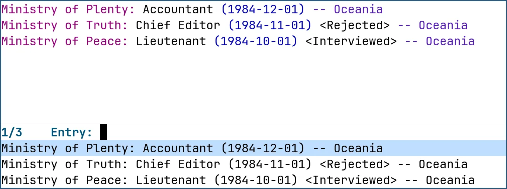

Joblog is an a major mode and `completing-read`-based interface for a textual file format that you can use to log your job applications.

If you're applying to a bunch of jobs on a bunch of different websites, it's very likely that you've run into the problem of staying sane as you attempt to keep a log of all your job applications.

Joblog's format is chronologically ordered, simple to read and write and most importantly, future-proof.

```
Ministry of Plenty: Accountant (1984-12-01) -- Oceania
Ministry of Truth: Chief Editor (1984-11-01) <Rejected> -- Oceania
Ministry of Peace: Lieutenant (1984-10-01) <Interviewed> -- Oceania
```



> I have yet to hear back from the Ministry of Plenty...

# Installation

Joblog is not yet available in any package archive so you'll have to obtain it
from source by evaluating the following:

``` emacs-lisp
(package-vc-install "https://git.sr.ht/~grtcdr/joblog" "2024.12.02")
```

# Usage

Your `joblog-file` is your personal database, you can use `customize-file` to set it.

Call the interactive `joblog` function, it will prompt you to enter a few details such as the company, the job title, the location and the date you applied for the position.

The information you enter will be saved to `joblog-file`. If you hear back from that company, call `joblog-change-status`, select the job from the list of candidates and set the new status from the list of `joblog-status-list`, you're free to add your own items to the list.

The next time you use `joblog`, the `completing-read` interface will make suggestions based on the existing content of your `joblog-file` which could save you some typing time and keep your file consistent.

You can use `joblog-visit` to jump into your `joblog-file` and makes changes directly, for example, to delete an item or change the job title. It's just text, just be careful to respect the rules of the file format, see Format section for more information.

Type `M-x customize-group SPC joblog RET` to consult all of Joblog's customization options.

# Format

```
COMPANY: JOB TITLE (YYYY-MM-DD) [-- LOCATION]
```

Notes:
- Location is noted in brackets to show that it is an optional field, when location is specified in the `completing-read` interface or when manually inserted, the brackets should not be included.
- Location can be used to insert the work modality, e.g. Remote, Hybrid, etc.

# Paradigm

Joblog's text-based nature opens the door to some interesting possibilities. For example, you can write Emacs Lisp functions or shell scripts that query your `joblog-file` for specific information and return pertinent statistics.

Here's an Emacs Lisp function that returns the rate of rejection of job applications:

```
(defun joblog-rejection-rate ()
  "Return the rate of rejection of job applications."
  (let* ((entries (joblog--entry-list (find-file-noselect joblog-file)))
	 (rejected (seq-filter (lambda (s) (string-match-p "<Rejected>" s)) entries)))
    (format "%.2f%" (* 100 (/ (float (length rejected)) (float (length entries)))))))
```

You can achieve similar results with `grep`, `wc` and other standard utilities.

# Support

If you wish to contribute a patch, inquire about something or share your feedback, you are welcome to send an email to [~grtcdr/pub@lists.sr.ht](mailto:~grtcdr/pub@lists.sr.ht). If this is your first time collaborating over email, please check out [this guide](https://git-send-email.io/). If you encounter issues of any kind, please file them in the project's [ticket tracker][ticket-tracker].

[mailing-list]: mailto:~grtcdr/pub@lists.sr.ht
[ticket-tracker]: https://todo.sr.ht/~grtcdr/joblog
